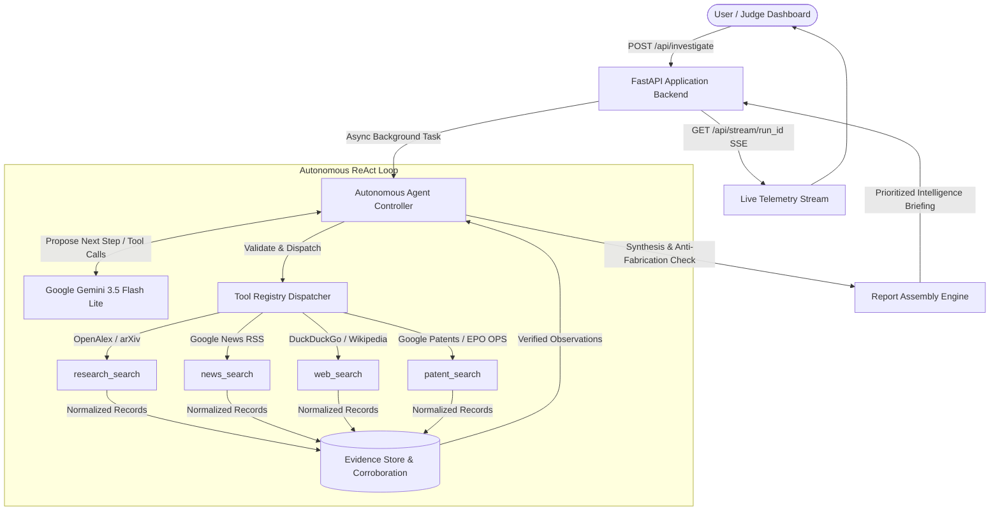

# AGENTX24

## Autonomous Research & Competitor Intelligence Agent

> An autonomous AI agent designed to continuously gather, analyze, prioritize, and synthesize intelligence across scientific research publications, competitor and industry news, web sources, and patent databases into cited, actionable intelligence reports.

[](https://www.python.org/)
[](https://fastapi.tiangolo.com/)
[](https://ai.google.dev/)
[]()

---

## Problem Statement

Organizations, startups, and research institutions operate in highly competitive and rapidly evolving environments where staying updated on research trends, patent developments, competitor strategies, industry news, and other relevant developments is critical.

However, manually monitoring scientific publications, patent databases, news platforms, and online information sources is time-consuming, inefficient, and prone to missing important updates. The lack of timely insights can result in lost opportunities, delayed innovation, and weakened competitive positioning.

There is therefore a need for an autonomous AI agent capable of continuously gathering information from multiple sources, analyzing it, prioritizing important developments, and delivering concise, actionable insights.

The solution should demonstrate genuine agentic behaviour rather than functioning as a simple scraper or information aggregator.

---

## Our Solution

**AGENTX24** is an end-to-end autonomous research and competitor tracking system powered by Google Gemini and a lightweight, trigger-agnostic Python controller. Instead of firing static API calls or dumping raw search aggregations, AGENTX24 operates through a dynamic ReAct-equivalent loop:

```
User investigation request
        ↓
AI agent analyzes the objective
        ↓
Agent autonomously decides which information sources to query
        ↓
Research / News / Web / Patent information is gathered
        ↓
Evidence is collected and validated
        ↓
Important signals are prioritized
        ↓
AI synthesizes actionable insights
        ↓
Results and live agent activity are displayed in the dashboard
```

---

## Key Features

- **Autonomous AI Agent Reasoning & Dynamic Tool Selection**: The agent evaluates findings turn-by-turn and dynamically determines which tool to invoke next, what query parameters to formulate, and whether follow-up investigations are required.
- **Multi-Source Real-World Intelligence Gathering**:
  - **Research Literature Tracking**: Real-time queries to **OpenAlex API** with automatic fallback to **arXiv Atom API**, extracting peer-reviewed publications, author affiliations, venues, publication dates, and citation metrics.
  - **Industry & Competitor News**: Real-time parsing of **Google News RSS** with publication date normalization and calculated `days_old` freshness indicators (plus optional NewsData.io support).
  - **Web Intelligence**: **DuckDuckGo** search with resilient automatic fallback to the **Wikipedia Search API**.
  - **Patent Intelligence**: Integrated **Google Patents** web-indexed database with direct patent links (plus modular **EPO OPS** OAuth support).
- **Prioritized Signal Categorization**: Findings are systematically categorized into:
  - `HIGH PRIORITY`: Crucial breakthroughs, decisive competitor actions, and major market shifts.
  - `IMPORTANT`: Notable updates, incremental advancements, and partnership milestones.
  - `EMERGING / WATCH`: Nascent research directions, early signals, and watch items.
- **Strict Anti-Fabrication Safeguards**:
  - Every factual claim is tied to an explicit evidence citation marker `[En]`.
  - The system automatically validates every citation marker against collected evidence, stripping unverified IDs.
  - The **Sources Reference List** is rendered directly by backend code from verified tool results, guaranteeing 100% genuine URLs.
- **Adaptive Report Structure**: Headings with no supporting evidence are cleanly omitted rather than displayed empty.
- **Live Agent Telemetry & Real-Time Dashboard**:
  - **Server-Sent Events (SSE)** stream live reasoning phases and concrete query arguments (e.g. `news_search("NVIDIA Blackwell...")`).
  - Active pulsing phase dot, ticking timer, capped ~12-item activity timeline, and streaming evidence feed.
  - Interactive citation chips `[En]` that smoothly scroll to matching verified sources.
- **Robust Loop Safety & Budgets**:
  - Hard iteration limit (`MAX_ITERATIONS=8`), tool call budget (`MAX_TOOL_CALLS=12`), tool timeout (`15s`), and wall-clock limit (`120s`).
  - Forced final synthesis when budgets are exhausted.
  - Strict filtering preventing internal reasoning/thought leaks from reaching telemetry.

---

## Agentic Architecture



---

## Technology Stack

- **Backend Runtime**: Python 3.14
- **Web Framework**: FastAPI & Uvicorn (ASGI server with Server-Sent Events)
- **Agent Intelligence**: Google Gemini API (`google-genai` SDK v2.19.0, default: `gemini-3.5-flash-lite`)
- **Data Models**: Pydantic v2
- **HTTP & Parsing**: HTTPX, stdlib `xml.etree.ElementTree`, `python-dotenv`, `ddgs`
- **Information Providers**: OpenAlex, arXiv, Google News RSS, DuckDuckGo, Wikipedia API, Google Patents, EPO OPS
- **Frontend**: Vanilla HTML5, modern CSS3 design system (zero external frameworks or web font dependencies for guaranteed offline/demo reliability), Vanilla JavaScript (SSE client, dynamic timeline, interactive citation anchors)

---

## Project Structure

```
D:\AGENTX24\
├── app\
│   ├── __init__.py           # Application package
│   ├── agent.py              # Autonomous ReAct loop, budgets, CLI runner
│   ├── config.py             # Environment loader, budgets, active providers
│   ├── llm.py                # Gemini LLM adapter with preflight and safe telemetry
│   ├── main.py               # FastAPI application, routes, SSE endpoints
│   ├── models.py             # Canonical data shapes (Evidence, Signal, Report, Run)
│   ├── report.py             # Anti-fabrication engine, citation validation, signal extraction
│   ├── store.py              # In-memory Run store and SSE broadcast queues
│   └── tools\
│       ├── __init__.py       # Central tool registry and execution dispatcher
│       ├── news.py           # Google News RSS search with days_old calculation
│       ├── patents.py        # Google Patents web-index and EPO OPS adapter
│       ├── research.py       # OpenAlex and arXiv Atom scientific paper search
│       └── web.py            # DuckDuckGo and Wikipedia search
├── web\
│   ├── app.css               # Token-based design system (4 designed UI states)
│   ├── app.js                # SSE client, live timeline, citation navigation
│   └── index.html            # Semantic judge dashboard interface
├── .env.example              # Safe configuration template with placeholder keys
├── .gitignore                # Stack-agnostic gitignore protecting secrets & caches
├── README.md                 # Complete project and run documentation
└── requirements.txt          # Pinned dependency manifest
```

---

## Installation and Setup

### Prerequisites
- Python 3.10+ (tested on Python 3.14)
- Google Gemini API Key (obtain from [Google AI Studio](https://aistudio.google.com/))

### Step-by-Step Setup (Windows PowerShell)

```powershell
# 1. Clone the repository
git clone https://github.com/fakegrandpa/AGENTX24.git
cd AGENTX24

# 2. Create and activate virtual environment
python -m venv .venv
.\.venv\Scripts\Activate.ps1

# 3. Install pinned dependencies
pip install -r requirements.txt

# 4. Configure environment variables
Copy-Item .env.example .env
```

Open `.env` and set your Gemini API key:
```dotenv
GEMINI_API_KEY=your_actual_gemini_api_key_here
GEMINI_MODEL=gemini-3.5-flash-lite
```

---

## Running the Project

### 1. Launch the Web Dashboard
```powershell
python -m uvicorn app.main:app --port 8000 --reload
```
Open your browser at: **[http://127.0.0.1:8000/](http://127.0.0.1:8000/)**

*(Inspect health status at `http://127.0.0.1:8000/api/health`)*.

### 2. Run Headless CLI Investigation
To run the autonomous agent directly in your terminal:

```powershell
# Industry / Competitor Target
python -m app.agent "NVIDIA"

# Scientific / Technical Target
python -m app.agent "CRISPR base editing off-target safety"

# Clean Energy Target
python -m app.agent "Solid-State Battery Degradation"
```

---

## How It Works

1. **Target Input**: The user enters a target company, competitor, research topic, or industry in the dashboard or CLI.
2. **Objective Analysis**: Gemini interprets the investigation objective and formulates initial search hypotheses.
3. **Autonomous Tool Selection**: The agent selects an appropriate information tool (`news_search`, `research_search`, `web_search`, or `patent_search`) with tailored arguments.
4. **Real-World Information Gathering**: The Python controller executes the tool against live APIs, normalizing output into structured `Evidence` items.
5. **Observation & Follow-Up**: The model observes findings and dynamically decides whether to follow up with a different angle or proceed to synthesis.
6. **Signal Analysis & Prioritization**: The agent extracts high-priority signals, emerging trends, and strategic implications, attaching exact citation chips.
7. **Anti-Fabrication Validation**: `report.py` calculates corroboration scores, verifies citations against gathered evidence, and strips unverified markers.
8. **Live Presentation**: The web dashboard streams timeline events in real time and renders the prioritized intelligence briefing with interactive source links.

---

## Team

- **Abhale Atharv**
- **Tushar Mate**
- **Yash Supekar**
- **Gaurav Sonawane**
- **Shardul Gaikwad**

---

## Hackathon Focus

**AGENTX24** directly addresses the challenge of **Research & Competitor Tracking** by replacing manual searches and basic scrapers with an **autonomous AI agentic workflow**:
- **Genuine Agentic Behavior**: The agent determines its own search trajectory based on intermediate findings rather than running a hardcoded sequence.
- **Cross-Domain Intelligence**: Automatically bridges academic research (OpenAlex/arXiv), market developments (Google News), web intelligence (DuckDuckGo/Wikipedia), and patent records (Google Patents).
- **Presentation-Ready**: Delivers prioritized, cited executive briefings with complete provenance back to verified real-world URLs.
